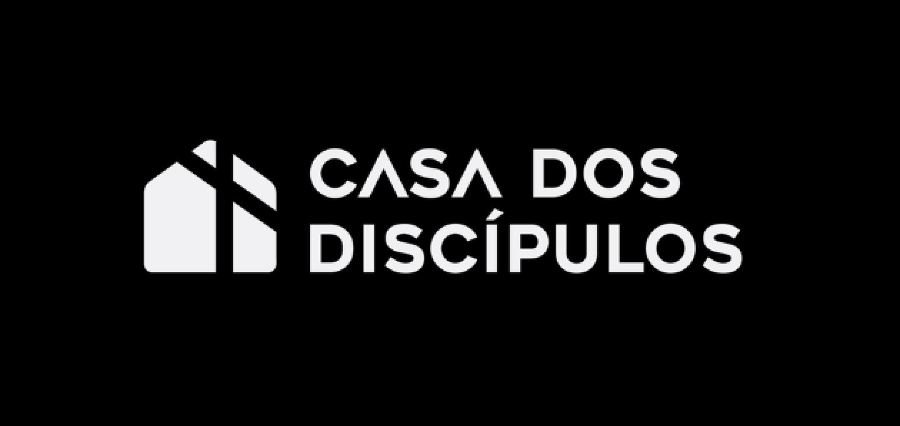

<div align="center">
  
  
  <h1>Casa dos Discípulos</h1>
  <p><strong>Plataforma de gestão e formação para igrejas</strong></p>
  <p>
    
    
    
    
    
    
  </p>
</div>

---

> **Casa dos Discípulos** é uma plataforma web moderna para gestão de cursos, células, eventos e acompanhamento de membros de igrejas. Desenvolvida para facilitar a formação, o engajamento e a administração da comunidade, com foco em usabilidade, segurança e flexibilidade.

## ✨ Principais Módulos

| Módulo | Descrição |
|--------|-----------|
| **Escola de Discípulos** | Módulos educacionais, quizzes e ranking gamificado |
| **Secretaria das Células** | Lições, formulários dinâmicos e relatórios semanais |
| **Eventos** | Carrossel na home e divulgação de cultos e atividades |
| **Fala Aí, Discípulo** | Devocional e palavra do dia |
| **Escala** | Calendário e escalas de ministérios com notificações WhatsApp |
| **Gestão** | Usuários, células, níveis e ministérios (admin, líder, membro) |

## 🚀 Stack Tecnológica

**Frontend**

- React 18+ (SPA, hooks, context)
- TypeScript
- React Router DOM
- Axios
- CSS Modules
- Jest, Testing Library

**Backend**

- Node.js 18+
- Express 5
- MySQL 8+ (Knex.js)
- JWT, Bcrypt
- Joi (validação)
- Helmet, CORS, express-rate-limit

## 🛠️ Instalação Rápida

### Backend

```bash
cd Codigo/backend
npm install
cp .env.example .env # ou crie manualmente
npm run migrate
npm run seed
npm run dev
```

### Frontend

```bash
cd Codigo/frontend
npm install
npm start
```

### Configuração do .env (Backend)

```env
PORT=3001
DB_HOST=localhost
DB_USER=root
DB_PASSWORD=sua_senha
DB_NAME=CasaDosDiscipulos
JWT_SECRET=minimo_32_caracteres_aleatorios_seguros
```

> **Documentação completa:** [Documentacao/README.md](Documentacao/README.md) — instalação detalhada, hospedagem, segurança e acessibilidade.

## 👤 Equipe

| Nome                               | Função        |
| ---------------------------------- | ------------- |
| Júlia Rocha Fiorini                | Dev/Full stack|
| Nalanda Luiza dos Santos           | Dev/Frontend  |
| Natalie Santana Dias Abreu         | Dev/Frontend  |
| Paloma Dias de Carvalho            | Dev/Frontend  |
| Pedro Henrique Germano de Melo     | Dev/Backend   |
| Raquel Cristina Pereira dos Santos | Dev/Backend   |

## 👨‍🏫 Professores

- João Paulo Carneiro Aramuni
- Ramon Lacerda Marques
- Bernardo Guerra Pereira Cunha

## 💡 Funcionalidades

- Autenticação segura (JWT, Bcrypt)
- Cadastro e gestão de membros
- Módulos, lições, quizzes e ranking gamificado
- Formulários dinâmicos (admin define campos: texto, textarea, número, data, etc.)
- Upload de arquivos, vídeos e imagens
- Painel administrativo completo
- Escala de ministérios com exportação para calendário (.ics)
- Notificações WhatsApp (Evolution API)
- Acessibilidade WCAG 2.1 (Skip Link, alto contraste, tamanho de texto)

## 🏗️ Estrutura do Projeto

```
├── Codigo/
│   ├── backend/
│   └── frontend/
├── Artefatos/ (wireframes, diagramas)
├── Documentacao/
└── README.md
```

## 🏢 Deploy & Hospedagem

- Requisitos: Node.js 18+, MySQL 8+, ambiente Linux/Windows
- Variáveis de ambiente para produção
- Suporte a uploads (pasta /uploads)
- Configuração de CORS e HTTPS recomendada
- Pode ser hospedado em Heroku, Vercel, DigitalOcean, AWS, Azure, etc.
- Backup regular do banco de dados

## 🧩 Dicas de Uso

- Use `npm run migrate` e `npm run seed` para preparar o banco
- Configure o `.env` antes de rodar
- Para desenvolvimento, use `npm run dev` no backend
- Acesse o frontend em `http://localhost:3000`

## 🏛️ Contexto Institucional

A Casa dos Discípulos precisava modernizar a forma como organizava seus materiais e atividades internas, que antes estavam dispersos entre arquivos, mensagens e controles manuais.

Para apoiar essa necessidade, desenvolvemos uma aplicação web responsiva que centraliza cursos, módulos, lições, quizzes e formulários da Secretaria das Células, além de permitir o gerenciamento de usuários.

O sistema foi pensado para oferecer mais organização, facilidade de acesso e autonomia para a comunidade, promovendo uma experiência mais estruturada tanto para administradores quanto para os discípulos.

- A Casa dos Discípulos não possuía um sistema centralizado para organizar suas atividades.
- Os materiais de cursos, módulos, lições e quizzes estavam dispersos e sem padronização.
- Não havia controle estruturado nem facilidade para administrar ou acessar conteúdos.
- A organização dependia de processos informais, o que gerava retrabalho e dificuldade de acompanhamento.

<div align="center">
  <sub>Projeto acadêmico - PUC Minas | ICEI | Engenharia de Software | 2025</sub>
</div>
